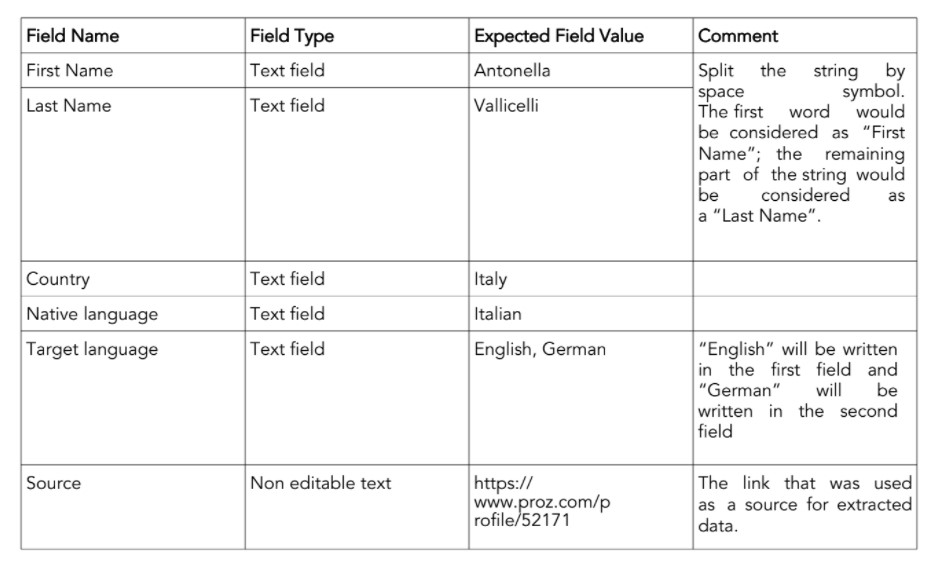
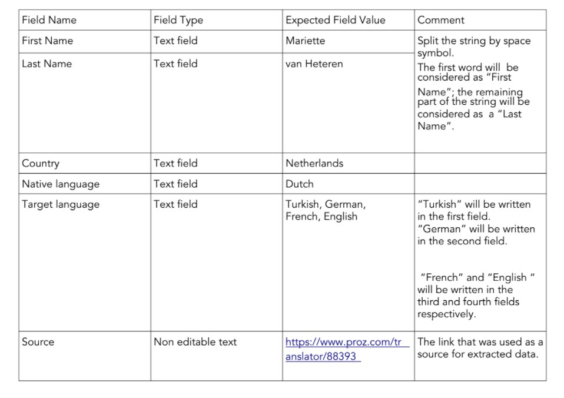

# README

## Assignment:

You will need to automate data extraction process from Proz (a Freelancer-like platform for linguists).

Since not all the fields can be extracted automatically, please build a two-page Rails App that would improve the data extraction process.

Firstly, enter the URL of a Proz profile. Next, click on the "Extract" button. The information from the Proz profile page should be extracted and appear in the editable fields (see the examples below). After closely reviewing the extracted data, click on the “Save” button allowing the data from the editable fields to be stored in the database. To keep things simple, please save all information in a single table.

Example 1:
Enter "https://www.proz.com/profile/52171" and click on the "Extract" button.  
On the second page the following editable fields with expected values should appear:



Example 2:
For https://www.proz.com/translator/88393, the extracted data should look like:


### Live Demo

Open [this link](https://travod-vm.herokuapp.com/) to view it live.

## Getting Started

To get a local copy up and running follow these simple example steps.

### Prerequisites

Ruby: 2.7.1
Rails: 6.0.3.4
Postgres: >=9.5

### Setup

```bash
$ git clone https://github.com/vmwhoami/travod
$ cd travod
```

Install gems with:

```
bundle install
```

Setup database with:

> make sure you have postgress sql installed and running on your system

```
   rails db:create
   rails db:migrate
```

> In case you have a problem with webpack

```
    yarn config set registry https://registry.npmjs.org
    rm yarn.lock
    yarn
```

### Usage

Start server with:

```
    rails server
```

Open `http://localhost:3000/` in your browser.

### Testing 
Run Rspec with:

```
    rspec
```

# Author

👤 **Vitalie Melnic**

- Github: [@vmwhoami](https://github.com/vmwhoami)
- Twitter: [@vmwhoami](https://twitter.com/vmwhoami)
- Linkedin: [vitalie-melnic](https://www.linkedin.com/in/vitalie-melnic/)

## 🤝 Contributing

Contributions, issues and feature requests are welcome!
